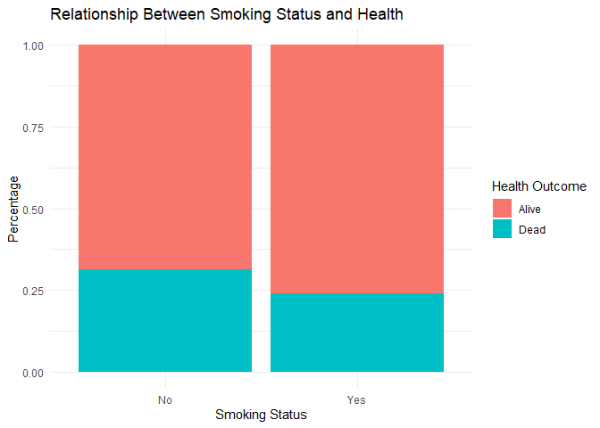
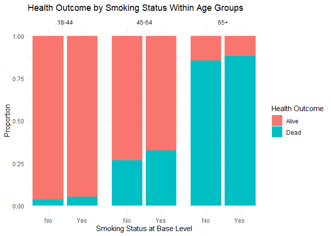

Lab 06 - Ugly charts and Simpson’s paradox
================
Insert your name here
Insert date here

### Load packages and data

``` r
library(tidyverse) 
library(dsbox)
library(mosaicData) 
```

``` r
staff <- read_csv("data/instructional-staff.csv")
```

    ## Rows: 5 Columns: 12
    ## ── Column specification ────────────────────────────────────────────────────────
    ## Delimiter: ","
    ## chr  (1): faculty_type
    ## dbl (11): 1975, 1989, 1993, 1995, 1999, 2001, 2003, 2005, 2007, 2009, 2011
    ## 
    ## ℹ Use `spec()` to retrieve the full column specification for this data.
    ## ℹ Specify the column types or set `show_col_types = FALSE` to quiet this message.

``` r
staff_long <- staff %>%
  pivot_longer(cols = -faculty_type, names_to = "year") %>%
  mutate(value = as.numeric(value))
```

``` r
staff_long %>%
  mutate(
    year = as.numeric(year),
    value = as.numeric(value),
    faculty_type = as.factor(faculty_type)
  ) %>%
  ggplot(aes(
    x = year,
    y = value,
    group = faculty_type,
    color = faculty_type
  )) +
  geom_line(size = 1) +
  labs(
    title = "Number of Employted Faculty Types (1975-2011)",
    x = "Year",
    y = "Number of Faculty",
    color = "Faculty Type"
  ) +
  theme_minimal()
```

    ## Warning: Using `size` aesthetic for lines was deprecated in ggplot2 3.4.0.
    ## ℹ Please use `linewidth` instead.
    ## This warning is displayed once per session.
    ## Call `lifecycle::last_lifecycle_warnings()` to see where this warning was
    ## generated.

<!-- -->

2.  I feel as if as the graph is already showing that the number of part
    time faculty is going up compared to other faculty types; in fact,
    it is the only one showing an upward trend.

3.  Regarding how the data visualization can be improved:

- The graph can be zoomed in so the representation is clearer
- The “Aquaculture” data visualization can be made to be like the
  “Capture” data visualization, such that it is easier to see the bars
  of little value.

Other than these fixes (both of which I do not know how to implement), I
think the graph and data visualizations look fine as they are.

### Exercise 1

These data were likely obtained from an observational study. I assume
that the researchers kept track of each individual’s life for a certain
amount of time and recorded the data accordingly. Though it does seem
fairly unreasonable to do so for a long amount of time and for so many
people, based on the data provided, my guess is it is observational

### Exercise 2

There are 1314 observations, each of which represents one individual
smoker.

### Exercise 3

There are three variables: whether the individual is alive or dead,
whether they were a smoker, and their age.

## Exercise 4

I would that if an individual is a smoker, there health is poorer, or
vice versa.

## Exercise 5

``` r
ggplot(Whickham, aes(x = smoker, fill = outcome)) +
  geom_bar(position = "fill") +
  labs(
    y = "Percentage",
    x = "Smoking Status",
    fill = "Health Outcome",
    title = "Relationsihp Between Smoking Status and Health"
  ) +
  theme_minimal()
```

<!-- -->

These results did not meet my expectations since there is a higher death
rate for individuals who do not smoke (27%) than for those who do (24%)
However, it has been proven that smoking leads to a lower life
expectancy, so I am guessing that of those who are dead and were not
smokers, some other confounding variable such as disease or murder is a
contributing factor. These results would lead you to believe smoking
makes little difference in whether you die younger or not, but I would
conclude that they are inaccurate regardless.

## Exercise 6

``` r
Whickham <- Whickham %>%
  mutate(
    age_cat = case_when(
      age <= 44 ~ "18-44",
      age > 44 & age <= 64 ~ "45-64",
      age > 64 ~ "65+"
    )
  )
```

## Exercise 7

``` r
Whickham %>%
  ggplot(aes(x = smoker, fill = outcome)) +
  geom_bar(position = "fill") +
  facet_wrap(~ age_cat) +
  labs(
    y = "Percentage",
    x = "Smoking Status",
    fill = "Health Outcome",
    title = "Relationship Between Smoking and Health By Age"
  ) +
  theme_minimal()
```

<!-- --> As opposed to
the previous graph, this plot seems to show that overall, individuals
who smoked ended up having a higher death rate than those who did not.
One possible contributing factor is that individuals who are younger are
likely to have not died as they are generally healthier than older
individuals, hence the 18-44 age group was skewing the data.

``` r
Whickham %>%
  count(age_cat, smoker, outcome) %>%
  group_by(age_cat, smoker) %>%
  mutate(prop = n / sum(n))
```

    ## # A tibble: 12 × 5
    ## # Groups:   age_cat, smoker [6]
    ##    age_cat smoker outcome     n   prop
    ##    <chr>   <fct>  <fct>   <int>  <dbl>
    ##  1 18-44   No     Alive     327 0.965 
    ##  2 18-44   No     Dead       12 0.0354
    ##  3 18-44   Yes    Alive     270 0.947 
    ##  4 18-44   Yes    Dead       15 0.0526
    ##  5 45-64   No     Alive     147 0.735 
    ##  6 45-64   No     Dead       53 0.265 
    ##  7 45-64   Yes    Alive     167 0.676 
    ##  8 45-64   Yes    Dead       80 0.324 
    ##  9 65+     No     Alive      28 0.145 
    ## 10 65+     No     Dead      165 0.855 
    ## 11 65+     Yes    Alive       6 0.12  
    ## 12 65+     Yes    Dead       44 0.88
